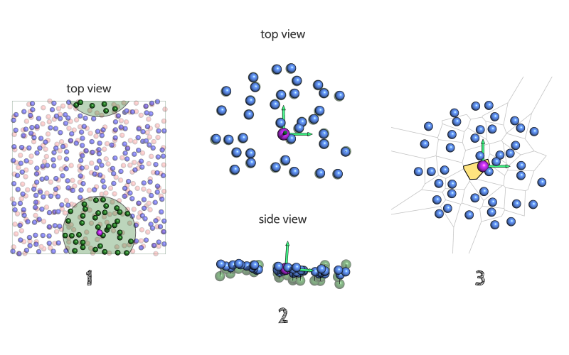
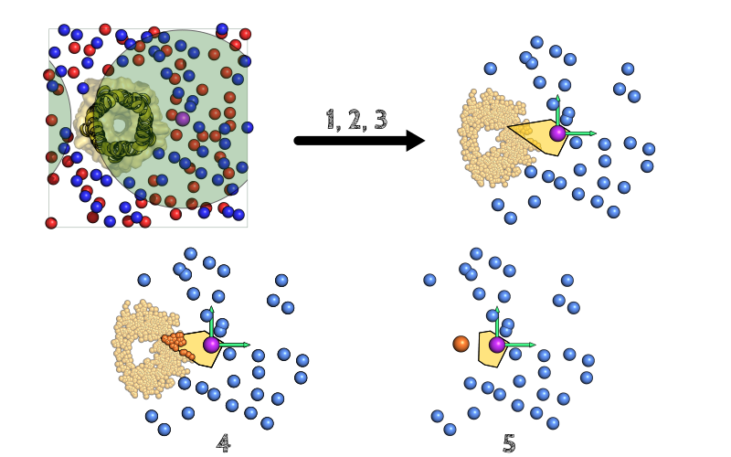

Membrane area and Area per lipid calculation
############################################

How FATSLiM estimates membrane area and area per lipid
******************************************************

.. _algo_apl:

Step 0. Membrane identification
===============================

As no knowledge of the other leaflet is required to perform area calculation on one leaflet, membrane identification is not required *per se*.
Yet, FATSLiM performs such calculation on a fully-identified membrane.
Please refer to the :ref:`corresponding section <algo_membrane_id>` in the :ref:`previous chapter <chapter_leaflet_membrane>` for details.

As for :ref:`thickness <algo_thickness>`, membrane area and area per lipid area estimated for every single lipid:
each lipid is successively taken as a reference and its accessible area (area per lipid) is calculated as described in the following.

Step 1. Estimating reference lipid's accessible area
====================================================

Depending on if a protein (or any molecule) is embedded inside the membrane, the algorithm is slightly modulated but it can be resumed by the following steps:

1. A neighbor search is performed to identify lipids (or protein atoms |--| see below) surrounding the reference (purple).
   The membrane region encompassed by the cutoff distance (green circle, :ref:`user-tweakable <parameter_apl_cutoff>`)
   is considered to have no curvature.

2. The local normal (yellow vector) is then used to project neighbor lipids onto the plane which
   (i) is perpendicular to the normal and
   (ii) that contains the reference lipid

3. Based on these projected lipids (light blue), the `Voronoi cell`_
   (yellow polygon) corresponding to the reference lipid is calculated and its area will used as an approximation of the lipid's accessible area.
   Even though it is not calculated (for computational efficiency), the whole `Voronoi diagram`_ is depicted here (grey lines) for clarity.

.. _Voronoi cell: https://en.wikipedia.org/wiki/Voronoi_diagram
.. _Voronoi diagram: https://en.wikipedia.org/wiki/Voronoi_diagram

.. tip::
    The above figure also illustrates how well FATSLiM handles the `PBCs <https://en.wikipedia.org/wiki/Periodic_boundary_conditions>`_:
    even though the neighborhood is broken because of the periodicity (left), the `minimum image convention <https://en.wikipedia.org/wiki/Periodic_boundary_conditions#Practical_implementation:_continuity_and_the_minimum_image_convention>`_
    makes sure that the actual coordinates used by FATSLiM make the neighborhood whole again (right).

When the membrane is only composed of lipids, the algorithm stops here and the area associated with each lipid (see below).
If, for instance, a protein is embedded inside the membrane, it must be taken into account:

4. First the calculation of the Voronoi cell (yellow polygon) is made as described (i.e. as if there were no protein),
   Then the protein atoms are projected on the same plane as the lipids (yellow) and the ones that are inside the reference cell (orange)
   are considered as they will likely alter the cell area.

.. seealso::
    See :ref:`--interacting-group <parameter_interacting_group>` parameter and the :ref:`APL tutorial <tuto_apl>` on how to select protein atoms.

5. The center of geometry corresponding to all these atoms is calculated (orange) and is added to the Voronoi points,
   leading to an updated cell (yellow polygon) for the reference lipid. The area of this modified cell will be used as an approximation of the lipid's accessible area.

Step 2. Area per lipid and membrane area
========================================

Because the algorithm gives an accessible area for each lipid, area per lipid can obviously be approximated as the average value of the accessible areas.
Accordingly, the leaflet area corresponds simply to the sum of all individual area and the membrane area is simply the average calculated from the two leaflet areas.

FATSLiM can also give the raw results (i.e. cell area for each lipid |--| :ref:`--export-raw-apl option <parameter_raw_apl>`)
and/or group areas by lipid type (:ref:`--apl-by-type <parameter_apl_by_type>`).

Calculation examples
====================

Here are a few examples of membrane area and area per lipid done with FATSLiM and other software for comparison.

.. seealso::

    Detailed description of these example systems is available :ref:`here <tuto_example_systems>`.

    Check :ref:`tutorial <tutorials>` section to learn how to make these calculation with FATSLiM.

Area per lipid
""""""""""""""

+-----------------+---------------+----------------------------------+--------------------------------------+--------------------------------------+-----------------------------------+---------------------------------+
|                                 | Flat membrane                                                                                                  | Vesicle                                                             |
+                                 +----------------------------------+--------------------------------------+--------------------------------------+-----------------------------------+---------------------------------+
|                                 | :ref:`lipid <tuto_lipid_system>` | :ref:`protein <tuto_protein_system>` | :ref:`peptide <tuto_peptide_system>` | :ref:`model <tuto_model_vesicle>` | :ref:`real <tuto_real_vesicle>` |
+=================+===============+==================================+======================================+======================================+===================================+=================================+
|                 | FATSLiM       | 49.0                             | 68.9                                 | 61.8                                 | 63.9 / 39.8                       | 79.5 / 49.9                     |
+                 +---------------+----------------------------------+--------------------------------------+--------------------------------------+-----------------------------------+---------------------------------+
|                 | `APL@Voro`_   | 48.6                             | 64.6                                 | 61.9                                 | |---|                             | |---|                           |
+                 +---------------+----------------------------------+--------------------------------------+--------------------------------------+-----------------------------------+---------------------------------+
| Area per lipid  | `GridMAT-MD`_ | 48.6                             | 65.1                                 | 61.8                                 | |---|                             | |---|                           |
+ (|ang|:sup:`2`) +---------------+----------------------------------+--------------------------------------+--------------------------------------+-----------------------------------+---------------------------------+
|                 | `MEMBPLUGIN`_ | 46.4                             | |---|                                | |---|                                | |---|                             | |---|                           |
+                 +---------------+----------------------------------+--------------------------------------+--------------------------------------+-----------------------------------+---------------------------------+
|                 | Manually [1]_ | 48.6                             | 67.8                                 | 61.2                                 | 64.0 / 40.0                       | 80.7 / 50.2                     |
+-----------------+---------------+----------------------------------+--------------------------------------+--------------------------------------+-----------------------------------+---------------------------------+

.. _APL@Voro: http://www.aplvoro.org/
.. _GridMAT-MD: http://www.bevanlab.biochem.vt.edu/GridMAT-MD/
.. _MEMBPLUGIN: https://sourceforge.net/projects/membplugin/
.. |---| unicode:: U+2014   .. em dash
.. |ang| unicode:: U+212B .. angstrom symbol

.. note::

    No area per lipid value means that the software is not able to work with such system.

Membrane area
"""""""""""""

+-----------------+---------------+----------------------------------+--------------------------------------+--------------------------------------+-----------------------------------+---------------------------------+
|                                 | Flat membrane                                                                                                  | Vesicle                                                             |
+                                 +----------------------------------+--------------------------------------+--------------------------------------+-----------------------------------+---------------------------------+
|                                 | :ref:`lipid <tuto_lipid_system>` | :ref:`protein <tuto_protein_system>` | :ref:`peptide <tuto_peptide_system>` | :ref:`model <tuto_model_vesicle>` | :ref:`real <tuto_real_vesicle>` |
+=================+===============+==================================+======================================+======================================+===================================+=================================+
|                 | FATSLiM       | 476.5                            | 38.6                                 | 38.9                                 | 1254 / 313                        | 1471 / 588                      |
+                 +---------------+----------------------------------+--------------------------------------+--------------------------------------+-----------------------------------+---------------------------------+
|                 | `APL@Voro`_   | 472.8                            | 36.1                                 | 39.0                                 | |---|                             | |---|                           |
+                 +---------------+----------------------------------+--------------------------------------+--------------------------------------+-----------------------------------+---------------------------------+
| Area            | `GridMAT-MD`_ | 472.7                            | 36.4                                 | 38.9                                 | |---|                             | |---|                           |
+ (nm\ :sup:`2`\ )+---------------+----------------------------------+--------------------------------------+--------------------------------------+-----------------------------------+---------------------------------+
|                 | `MEMBPLUGIN`_ | 453.5                            | |---|                                | |---|                                | |---|                             | |---|                           |
+                 +---------------+----------------------------------+--------------------------------------+--------------------------------------+-----------------------------------+---------------------------------+
|                 | Manually [1]_ | 472.7                            | 38.2                                 | 38.6                                 | 1256 / 314                        | 1493 / 592                      |
+-----------------+---------------+----------------------------------+--------------------------------------+--------------------------------------+-----------------------------------+---------------------------------+

.. note::

    No area value means that the software is not able to work with such system.

Associated command and parameters
*********************************

Command
=======

If you want FATSLiM to estimate membrane area and area per lipid, use the following command:

.. code-block:: bash

    fatslim apl

Parameters
==========

In addition to the common :ref:`analytical parameters <analytical_parameters>`,
Some parameters are specific to the ``apl`` command.

Analytical parameters
"""""""""""""""""""""

.. _parameter_apl_cutoff:

Cutoff distance for area per lipid calculation
~~~~~~~~~~~~~~~~~~~~~~~~~~~~~~~~~~~~~~~~~~~~~~

- **Associated parameter:** ``--apl-cutoff``

- **Purpose:** This option allows user to specify the cutoff distance (in nm) to be used when
  performing the neighbor search needed by the APL calculation algorithm.

- **Default value:** ``3.0``

.. _parameter_apl_limit:

Upper limit for area per lipid
~~~~~~~~~~~~~~~~~~~~~~~~~~~~~~

- **Associated parameter:** ``--apl-limit``

- **Purpose:** This option allows user to specify the upper limit (in nm\ :sup:`2`\ ) for a valid
  area per lipid value.

- **Default value:** ``10.0``

.. _parameter_apl_by_type:

Grouping per lipid type
~~~~~~~~~~~~~~~~~~~~~~~

- **Associated parameter:** ``--apl-by-type``

- **Purpose:** This option allows user to specify that area per lipid values should be grouped by lipid type (i.e. same lipid name).

- **Default value:** ``False``

Output files
""""""""""""

Plotting area per lipid
~~~~~~~~~~~~~~~~~~~~~~~

- **Associated parameter:** ``--plot-apl``

- **Purpose:** This option specifies the filename where FATSLiM should save the area per lipid average values (for membrane and both leaflets) over time (as a XY plot).

- **Accepted file extensions:** `.xvg`_

- **Default value:** None (no output file)

.. _.xvg: http://manual.gromacs.org/current/online/xvg.html

Plotting area per lipid
~~~~~~~~~~~~~~~~~~~~~~~

- **Associated parameter:** ``--plot-area``

- **Purpose:** This option specifies the filename where FATSLiM should save the area average values (for membrane and both leaflets) over time (as a XY plot).

- **Accepted file extensions:** `.xvg`_

- **Default value:** None (no output file)

.. _parameter_raw_apl:

Raw area per lipid values
~~~~~~~~~~~~~~~~~~~~~~~~~

- **Associated parameter:** ``--export-apl-raw``

- **Purpose:** This option specifies the filename where FATSLiM should save the raw area per lipid (as calculated by the algorithm |--| one value per lipid).
  These values are saved in a `comma separated values <.csv>`_ file.
  To ease further processing the file contains the following columns:

    * residue number (resid)
    * leaflet identifier (e.g. "lower leaflet")
    * lipid coordinates (three columns for x, y and z)
    * area per lipid (in nm\ :sup:`2`\ ).

- **Accepted file extensions:** `.csv`_

- **Default value:** None (no output file)

.. _.csv: https://en.wikipedia.org/wiki/Comma-separated_values

.. |--| unicode:: U+2013   .. en dash

.. [1] See FATSLiM's original paper for details