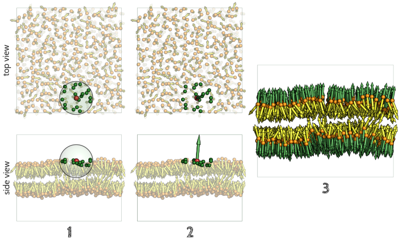

.. _chapter_leaflet_membrane:

Leaflet and membrane identification
###################################

How FATSLiM identifies leaflets and membranes
*********************************************

.. _concept_lipid_simplification:

Step 1. Lipid simplification
============================

A full description of the lipids is not essential to the calculation of most bilayer properties.
This is why, when appropriate, FATSLiM describes each lipid by one *bead* for the head group and one *vector* for its orientation:

This leads to a rather simplified description of the system which is used internally by FATSLiM:

.. figure:: images/system_simplification.png
    :align: center

The role of the :ref:`index file <index_file_input>` that users need to provide is to define the atoms to be considered as the head group.
FATSLiM identifies lipids based on residue indices meaning that atoms from the same residue (as in same residue index) will be considered as being part of the same head group
and their `centroid <https://en.wikipedia.org/wiki/Centroid>`_ will be used for the resulting *bead*. This also means that a lipid molecule must be defined as a single residue for FATSLiM to work properly.
The lipid direction is simply inferred from the *vector* from the head group *bead* to the whole lipid centroid.

.. seealso::
    See :ref:`tuto_generate_ndx` for further details.

.. _algo_local_normals:

Step 2. Local normal calculation
================================

The key feature of FATSLiM is to use the calculation of local normals rather than to rely on assumption on the membrane topology and/or orientation.
Normal estimation from a point cloud (here the cloud made by the lipid *beads*) is intensively used in domains such as computer graphics or surface reconstruction
from `Lidar <https://en.wikipedia.org/wiki/Lidar>`_ data for instance.

In a nutshell, normal estimation is done in three steps:

1. For each lipid, the point cloud considered is consituted by all the *beads* within a user-tweakable cutoff distance (see :ref:`--cutoff <cutoff_leaflet_opt>`) from the reference lipid.

.. important::
    FATSLiM is `PBC-aware <https://en.wikipedia.org/wiki/Periodic_boundary_conditions>`_, so
    the neighbor search performed here, as well as *all* the later ones, satisfy the
    `minimum image convention <https://en.wikipedia.org/wiki/Periodic_boundary_conditions#Practical_implementation:_continuity_and_the_minimum_image_convention>`_.

2. A `principal component analysis <https://en.wikipedia.org/wiki/Principal_component_analysis>`_ is performed. The eigenvector related to the smallest eigenvalue is the normal.

3. This process is repeated for all the lipids, giving as many local normals as there are lipids.

.. seealso::
    If you want more details on normal estimation, you should take a look at the `Point Cloud Library <http://pointclouds.org/>`_
    and, in particular, its `3D feature tutorial <http://pointclouds.org/documentation/tutorials/how_features_work.php>`_.

Step 3. Leaflets and membrane identification
============================================

Leaflets identification
"""""""""""""""""""""""

To be considered as part of the same leaflet, two lipids must fulfill the following conditions:

1. They must be close (i.e. closer than the cutoff distance)

2. Their orientation must be compatible (i.e. roughly colinear and not anti-parallel)

The leaflet is then identified from lipid to lipid.

.. _algo_membrane_id:

Membrane identification
"""""""""""""""""""""""

Once the leaflets are identified, they are checked for compatibility:

* They must be constituted from, at least, 30 lipids

* If both planar:

    1. the distance between both leaflets both not exceed 10 nm (i.d. must be realistic)

    2. the two mean normals (one for each leaflet) must be (roughly) anti-parallel

* If both non-planar (i.d. leaflets from a vesicle):

    1. the two centers of geometry must be close (i.d. leaflet must be concentrical)

Examples
========

Here are a few examples of membrane identification as done by FATSLiM:

    Leaflets from the same membrane are represented using two shades of the same color.
    No color means that the aggregate does not belong to any membrane.
    Proteins (when present) are depicted in purple using the *cartoon* representation.

Associated command and parameters
*********************************

Command
=======

If you want FATSLiM to identify membranes, use the following command:

.. code-block:: bash

    fatslim membranes

Parameters
==========

In addition to the common :ref:`analytical parameters <analytical_parameters>`,
Some parameters are specific to the ``membranes`` command.

Analytical parameters
"""""""""""""""""""""

Cutoff distance for leaflet identification
~~~~~~~~~~~~~~~~~~~~~~~~~~~~~~~~~~~~~~~~~~

Because all analytical commands rely on membrane identification,
the cutoff distance associated with the normal estimation and the membrane identification
(option :ref:`--cutoff <cutoff_leaflet_opt>`) is described with other :ref:`common analytical parameters <analytical_parameters>`.

Output files
""""""""""""

Number of membranes
~~~~~~~~~~~~~~~~~~~

- **Associated parameter:** ``--output`` or ``-o``

- **Purpose:** This option specifies the filename where FATSLiM should save the number of membranes found over time (as a XY plot).

- **Accepted file extensions:** `.xvg`_

- **Default value:** None (no output file)

.. _.xvg: http://manual.gromacs.org/current/online/xvg.html

Leaflets and headgroups
~~~~~~~~~~~~~~~~~~~~~~~

- **Associated parameter:** ``--output-index`` (full lipids) or ``--output-index-hg`` (only headgroup)

- **Purpose:** Once membrane identification is done, these two options allow users to save the lipid (``--ouput-index``) or head group (``--output-index-hg``) atoms to an index file so the atoms (grouped by leaflet) can used as selection for other tools such as the GROMACS ones.

- **Accepted file extensions:** `.ndx`_.

- **Default values:** None (no output file)

.. _.ndx: http://manual.gromacs.org/current/online/ndx.html

.. seealso::

    Tutorial: :ref:`tuto_membrane_identification`

