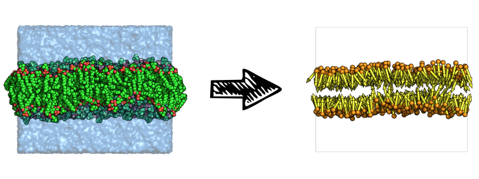

Leaflet and membrane identification
###################################

How FATSLiM identifies leaflets and membranes?
**********************************************

.. _concept_lipid_simplification:

Step 1. Lipid simplification
============================

A full description of the lipids is not essential to the calculation of most bilayer properties.
This is why, when appropriate, FATSLiM uses a crude simplification of the lipids which are described by:

1. A *bead* corresponding to their head group

2. A *vector* corresponding to their orientation

This can be summarized by the following figure:

    Solvated membrane and (left) and its simplified version used internally by FATSLiM (right).

The role of the :ref:`index file <index_file_input>` that users need to provide is to define the atoms to be considered as the head group.
FATSLiM identifies lipids based on residue indices meaning that atoms from the same residue (as in same residue index) will be considered as being part of the same head group
and their `centroid <https://en.wikipedia.org/wiki/Centroid>`_ will be used for the resulting *bead*. This also means that a lipid molecule must be defined as a single residue for FATSLiM to work properly.
The lipid direction is simply inferred from the *vector* from the head group *bead* to the whole lipid centroid.

.. seealso::
    See :ref:`tuto_generate_ndx` for further details.

Step 2. Local normal calculation
================================

The key feature of FATSLiM is to use the calculation of local normals rather than to rely on assumption on the membrane topology and/or orientation.
Normal estimation from a point cloud (here the cloud made by the lipid *beads*) is intensively used in domains such as computer graphics or surface reconstruction
from `Lidar <https://en.wikipedia.org/wiki/Lidar>`_ data for instance.

Because membrane normal is estimated as a local feature, its calculation depends on

.. figure:: images/normal_calculation.png
    :align: center

    TBD

.. seealso::
    If you want more details on normal estimation, you should take a look at the `Point Cloud Library <http://pointclouds.org/>`_
    and, in particular, at its `3D feature tutorial <http://pointclouds.org/documentation/tutorials/how_features_work.php>`_.

Step 3. Leaflet identification
==============================

Associated command and parameters
*********************************

Command
=======

Parameters
==========

.. seealso::

    Tutorial: :ref:`tuto_membrane_identification`

