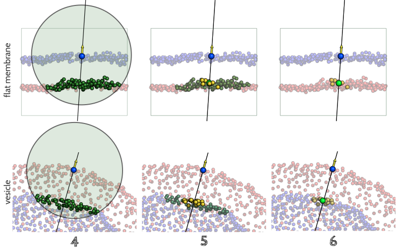
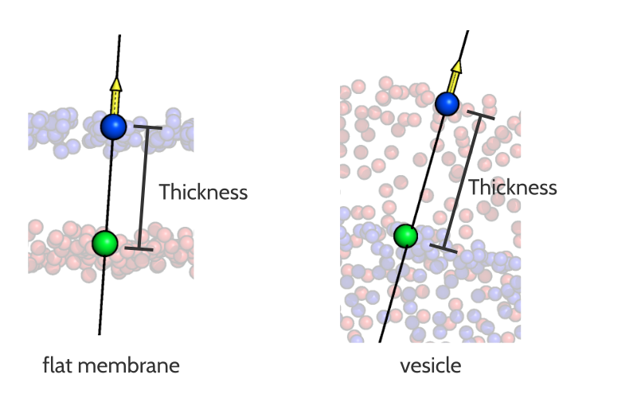

Thickness calculation
#####################

How FATSLiM estimates membrane thickness
****************************************

.. _algo_thickness:

Step 0. Membrane identification
===============================

Obviously, before estimating membrane thickness (or inter-leaflet distance), the major prerequisite is to identify the actual membrane and its leaflets!
Please refer to the :ref:`corresponding section <algo_membrane_id>` in the :ref:`previous chapter <chapter_leaflet_membrane>` for details.

Once leaflets are clearly identified, membrane thickness is estimated for every single lipid:
successively, each lipid is taken as a reference and the inter-leaflet distance is calculated as described in the following.

Estimating inter-leaflet distance from reference lipid
======================================================

Because fluctuations of lipid positions are very likely to introduce noise when estimating membrane thickness,
FATSLiM does not rely on single lipid coordinates to calculate inter-leaflet distance but rather
uses neighborhood-averaged coordinates to smooth the individual fluctuations out.

Reference lipid position
""""""""""""""""""""""""

As described the position of the reference is modulated according to its neighborhood.
This procedure can be summarized as follows:

1. A neighbor search is performed to identify lipids (green) surrounding the reference (purple).
For consistency (as well as computational efficiency) purposes, the results from the neighbor search
done previously to :ref:`calculate normals <algo_local_normals>` are used here.

2. When its normal is almost parallel (a hard-coded 10 degree tolerance is used) to the reference normal,
a lipid is selected (yellow) to modulate the reference position.
This step may be unnecessary when dealing with flat membranes but it can become necessary to avoid bias
in the case of membranes with higher curvature.

3. An averaged position (orange) is calculated from the selected neighbors.
This position, with the addition of the local normal (yellow arrow and black line) will be used to estimate inter-leaflet distance.

Average position of the other leaflet
"""""""""""""""""""""""""""""""""""""

Similarly to what was described previously, an average position is also calculated for the other leaflet:

4. A neighbor search is performed to identify the lipids which (i) are close to the reference position
and (ii) belong the other leaflet. Obviously, the cutoff distance used for this neighbor search needs
to be big enough to reach the other leaflet (default value: 6.0 nm. See :ref:`--thickness-cutoff <parameter_thickness_cutoff>`).

5. If the distance vector between the neighbor and the reference position is almost parallel
(a hard-coded 10 degree tolerance is used) with the reference normal, the corresponding lipid is selected (yellow).

6. An averaged position (green) is calculated from the selected neighbors.

Thickness estimation
""""""""""""""""""""

The inter-leaflet distance is estimated as the projection of the distance vector **dx** between the two averaged positions:

Calculation examples
====================

Here are a few examples of membrane thickness calculation doe with FATSLiM and other software for comparison:

+------------+---------------+----------------------------------+--------------------------------------+--------------------------------------+-----------------------------------+---------------------------------+
|                            | Flat membrane                                                                                                  | Vesicle                                                             |
+                            +----------------------------------+--------------------------------------+--------------------------------------+-----------------------------------+---------------------------------+
|                            | :ref:`lipid <tuto_lipid_system>` | :ref:`protein <tuto_protein_system>` | :ref:`peptide <tuto_peptide_system>` | :ref:`model <tuto_model_vesicle>` | :ref:`real <tuto_real_vesicle>` |
+============+===============+==================================+======================================+======================================+===================================+=================================+
|            | FATSLiM       | 4.08                             | 3.16                                 | 3.82                                 | 4.98                              | 3.95                            |
+            +---------------+----------------------------------+--------------------------------------+--------------------------------------+-----------------------------------+---------------------------------+
|            | `APL@Voro`_   | 4.07                             | 3.15                                 | 3.99                                 | |---|                             | |---|                           |
+            +---------------+----------------------------------+--------------------------------------+--------------------------------------+-----------------------------------+---------------------------------+
| Thickness  | `GridMAT-MD`_ | 4.06                             | 3.18                                 | 3.81                                 | |---|                             | |---|                           |
+   (nm)     +---------------+----------------------------------+--------------------------------------+--------------------------------------+-----------------------------------+---------------------------------+
|            | `MEMBPLUGIN`_ | 4.28                             | 3.17                                 | 3.80                                 | |---|                             | |---|                           |
+            +---------------+----------------------------------+--------------------------------------+--------------------------------------+-----------------------------------+---------------------------------+
|            | Manually      | 4.07                             | 3.15                                 | 3.79                                 | 5.00                              | 4.00                            |
+------------+---------------+----------------------------------+--------------------------------------+--------------------------------------+-----------------------------------+---------------------------------+

.. _APL@Voro: http://www.aplvoro.org/
.. _GridMAT-MD: http://www.bevanlab.biochem.vt.edu/GridMAT-MD/
.. _MEMBPLUGIN: https://sourceforge.net/projects/membplugin/
.. |---| unicode:: U+2014   .. em dash

.. note::

    No thickness value means that the software is not able to work with such system.

.. seealso::

    Detailed description of these example systems is available :ref:`here <tuto_example_systems>`.

    Check :ref:`tutorial <tutorials>` section to learn how to make these calculation with FATSLiM.

Associated command and parameters
*********************************

Command
=======

If you want FATSLiM to estimate membrane thickness, use the following command:

.. code-block:: bash

    fatslim thickness

Parameters
==========

In addition to the common :ref:`analytical parameters <analytical_parameters>`,
Some parameters are specific to the ``thickness`` command.

Analytical parameters
"""""""""""""""""""""

.. _parameter_thickness_cutoff:

Cutoff distance for inter-leaflet neighbor search
~~~~~~~~~~~~~~~~~~~~~~~~~~~~~~~~~~~~~~~~~~~~~~~~~

- **Associated parameter:** ``--thickness-cutoff``

- **Purpose:** This option allows user to specify the cutoff distance (in nm) to be used when
  performing the inter-leaflet neighbor search needed by the thickness calculation algorithm.

- **Default value:** ``6.0``

Output files
""""""""""""

Plotting thickness
~~~~~~~~~~~~~~~~~~

- **Associated parameter:** ``--plot-thickness``

- **Purpose:** This option specifies the filename where FATSLiM should save the thickness average values (for membrane and both leaflets) found over time (as a XY plot).

- **Accepted file extensions:** `.xvg`_

- **Default value:** None (no output file)

.. _.xvg: http://manual.gromacs.org/current/online/xvg.html

Raw thickness values
~~~~~~~~~~~~~~~~~~~~

- **Associated parameter:** ``--export-thickness-raw``

- **Purpose:** This option specifies the filename where FATSLiM should save the raw thicknesses (as calculated by the algorithm |--| one value per lipid).
  These values are saved in a `comma separated values <.csv>`_ file.
  To ease further processing the file contains the following columns:

    * residue number (resid)
    * leaflet identifier (e.g. "lower leaflet")
    * lipid coordinates (three columns for x, y and z)
    * thickness value (in nm).

- **Accepted file extensions:** `.csv`_

- **Default value:** None (no output file)

.. _.csv: https://en.wikipedia.org/wiki/Comma-separated_values

.. |--| unicode:: U+2013   .. en dash