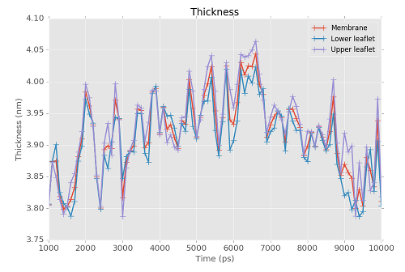

.. _tutorials:

Tutorials & Examples
####################

This chapter contains a few information and examples to get familiarized with FATSLiM.

.. _tuto_test_systems:

Test systems
************

The following MD systems are used both in the tutorials and as tests to check FATSLiM accuracy (see
:ref:`thickness <thickness_accuracy>` and :ref:`area per lipid <apl_accuracy>` chapters)

.. _tuto_lipid_system:

Lipid-only system
=================

.. figure:: images/bilayer_chol_nobox.png
    :align: center

This system is originally from `Lukat et al. <http://dx.doi.org/10.1021/ci400172g>`_, in which it is called system M2.
It consists of a coarse-grained (Martini force field) planar bilayer made of
828 DPPC, 540 DLPC and 576 cholesterol molecules. Details about this system can be found in the
original paper and the corresponding files are freely available from
the APL@Voro `website <aplvoro_downloads>`_.

- Input files used in tests and/or tutorials:
    * :download:`bilayer_chol.gro <tutorials/bilayer_chol.gro>`
    * :download:`bilayer_chol.ndx <tutorials/bilayer_chol.ndx>`

.. _aplvoro_downloads: http://www.aplvoro.org/index.php?section=downloads

.. _tuto_protein_system:

Protein system
==============

.. figure:: images/bilayer_prot_nowater.png
    :align: center

This is originally from `Krüger and Fischer <http://dx.doi.org/10.1007/s00249-009-0487-0>`_ but is also mentioned in `Lukat et al. <http://dx.doi.org/10.1021/ci400172g>`_ as system M3.
It is made of Vpu pore embedded in a membrane made of 112 DOPC. This pore results from the aggregation of
five VPU1−32 WT peptides and is then not a protein *per se*. Yet, the size and morphology of
this pentameric assembly is comparable to a real trans-membrane protein and the analysis
is quite similar. Details about this system can be found in the original paper and the corresponding
files are freely available from the APL@Voro `website <aplvoro_downloads>`_.

- Input files used in tests and/or tutorials:
    * :download:`bilayer_prot.gro <tutorials/bilayer_prot.gro>`
    * :download:`bilayer_prot.ndx <tutorials/bilayer_prot.ndx>`

.. _tuto_peptide_system:

Peptide system
==============

.. figure:: images/bilayer_kalp.png
    :align: center

This system is based on work by `Kandasamy and Larson <http://dx.doi.org/10.1529/biophysj.105.073395>`_ and consists of a single
trans-membrane KALP15 peptide (sequence: Ac-GKK(LA)\ :sub:`4` - LKKA-NH\ :sub:`2`\ ) embedded in
a bilayer made of 126 DPPC.

- Input files used in tests and/or tutorials:
    * :download:`bilayer_peptide.gro <tutorials/bilayer_peptide.gro>`
    * :download:`bilayer_peptide.ndx <tutorials/bilayer_peptide.ndx>`
    * :download:`bilayer_peptide.xtc <tutorials/bilayer_peptide.xtc>`

.. _tuto_model_vesicle:

Model vesicle
=============

.. figure:: images/model_vesicle.png
    :align: center

The model vesicle made of 2748 DPPC. It was built *ex nihilo* by positioning and orienting
lipid molecules on two concentric spheres. Because
this system is artificially generated, its properties are known: the membrane thickness is
set to 5 nm and the area per lipid for both leaflets are set to 40 |ang|:sup:`2`
(inner) and 64 |ang|:sup:`2` (outer), respectively.

- Input files used in tests and/or tutorials:
    * :download:`model_vesicle.gro <tutorials/model_vesicle.gro>`
    * :download:`model_vesicle.ndx <tutorials/model_vesicle.ndx>`

.. _tuto_real_vesicle:

Real vesicle
============

.. figure:: images/dppc_vesicle.png
    :align: center

This vesicle (3030 DPPC) was obtained from the self-aggregation of MARTINI lipids.

- Input files used in tests and/or tutorials:
    * :download:`dppc_vesicle.gro <tutorials/dppc_vesicle.gro>`
    * :download:`dppc_vesicle.ndx <tutorials/dppc_vesicle.ndx>`
    * :download:`dppc_vesicle.xtc <tutorials/dppc_vesicle.xtc>`

.. _tuto_generate_ndx:

Generating the index file
*************************

FATSLiM uses a `GROMACS index file <.ndx>`_ to identify the atoms corresponding to lipid headgroup so
every GROMACS users should be at ease and already know how to use the ``gmx make_ndx`` `utility <make_ndx>`_
provided by GROMACS.

.. _.ndx: http://manual.gromacs.org/current/online/ndx.html
.. _make_ndx: http://manual.gromacs.org/current/programs/gmx-make_ndx.html

In the following examples, the atom selection along with the index file will be provided to make things
as clear as possible. See :ref:`below <tuto_make_ndx>` for a complete and comprehensive example.

Analysis tutorials
******************

This section presents several examples of analysis you can do with FATSLiM.
All the following tutorials refer to the MD systems presented above.

.. _tuto_membrane_identification:

Tutorial #1: Simple membrane identification
===========================================

- **Goal:** Identify leaflets from the :ref:`lipid-only system <tuto_lipid_system>` and save them to
  an index file
- **Configuration file:** :download:`bilayer_chol.gro <tutorials/bilayer_chol.gro>`

.. _tuto_make_ndx:

Index file
""""""""""

- **Atoms selected as headgroups**: *PO4* for DUPC and DPPC residues  and *ROH* for CHOL residue.

.. important::

    FATSLiM uses these atoms to identify lipids assuming the selected atoms are lipid headgroups.
    You can select several atoms from the same residue (e.g. *PO4* and *NC3* beads for Martini phospholipids)
    without any problem (FATSLiM will just use the center of geometry as the lipid head group position)
    as long as all the atoms belong to the actual lipid headgroup.

When working with Martini lipids, the most common choice is to choose the phosphate moiety (*PO4* bead)
to describe phospholipid headgroups. For the cholesterol molecule, the alcool moiety (*ROH* bead) is usually used.

Before performing analysis, you must create an index file containing these atoms so FATSLiM can
identify lipids:

1. Launch ``gmx make_ndx`` using :download:`bilayer_chol.gro <tutorials/bilayer_chol.gro>` as input file:

.. code-block:: bash

    gmx make_ndx -f bilayer_chol.gro -o bilayer_chol.ndx

You should see the default groups GROMACS creates:

.. code-block:: bash

    0 System              : 33624 atoms
    1 Other               : 33624 atoms
    2 DPPC                :  9936 atoms
    3 DUPC                :  6480 atoms
    4 W                   : 12600 atoms
    5 CHOL                :  4608 atoms

2. Create the group to store headgroups. As the *PO4* bead and the *ROH* only belong to the phospholipids and the cholesterol,
   respectively, you can simply use the following selection string:

.. code-block:: bash

    a PO4 ROH

This will create a new group:

.. code-block:: bash

    6 PO4_ROH             :  1944 atoms

3. Optionally, you can rename this group to be more explicit:

.. code-block:: bash

    name 6 headgroups

4. Finally, you can delete the other groups which are not needed by FATSLiM (this is also completely optional):

.. code-block:: bash

    del 0-5

5. Quit ``gmx make_ndx`` and there should be an index file named ``bilayer_chol.ndx`` that will be
   used by FATSLiM

Voilà, you are now ready to use FATSLiM!

Analysis
""""""""

As, previously described, FATSLiM needs at least :ref:`two files <common_input_files>` to perform analysis. Here will be used:

- :download:`bilayer_chol.gro <tutorials/bilayer_chol.gro>` which will provide the atom coordinates and system topology

- bilayer_chol.ndx you created to provide lipid headgroups (a safe version of this file
  is available :download:`here <tutorials/bilayer_chol.ndx>`)

To identify the leaflets and store them into an index file use the following command:

.. code-block:: bash

    fatslim membranes -c bilayer_chol.gro -n bilayer_chol.ndx --output-index bilayer_chol_leaflet.ndx

Alternatively, if you did not rename the group in the previous section, you have to specify the name of the group
to use in the index file:

.. code-block:: bash

    fatslim membranes -c bilayer_chol.gro -n bilayer_chol.ndx --output-index bilayer_chol_leaflet.ndx --hg-group PO4_ROH

In both cases, this will create a file named :download:`bilayer_chol_leaflet_0000.ndx <tutorials/bilayer_chol_leaflet_0000.ndx>`
which can be used for further processing (e.g. extracting leaflets from your trajectory with ``gmx trjconv``)

.. note::

    The frame index (starting from 0) is appended to the filename as one index file is created per frame.
    Hence *bilayer_chol_leaflet_0000.ndx* instead of *bilayer_chol_leaflet.ndx*

Tutorial #2: Membrane thickness over trajectory
===============================================

- **Goal:** Plotting the membrane thickness over a trajectory
- **Configuration file:** :download:`bilayer_peptide.gro <tutorials/bilayer_peptide.gro>`
- **Trajectory file:** :download:`bilayer_peptide.xtc <tutorials/bilayer_peptide.xtc>`
- **Atoms selected as headgroups**: *P8* (Phosphorus atom)
- **Index file:** :download:`bilayer_peptide.ndx <tutorials/bilayer_peptide.ndx>`

.. note::

    Generating the (provided) index file using the atom selection is left as an exercise.

    Check the :ref:`above tutorial <tuto_make_ndx>` if needed.

FATSLiM is able to store results into a `.xvg <http://manual.gromacs.org/current/online/xvg.html>`_ file so you can plot them.
Here it is used to plot the thickness of a DPPC vesicle over a (pretty small |--| this is an example!) MD trajectory.
Run the following command:

.. code-block:: bash

    fatslim thickness -c bilayer_peptide.gro -n bilayer_peptide.ndx -t bilayer_peptide.xtc --plot-thickness bilayer_peptide_thickness.xvg

It should give an output similar to this one:

.. code-block:: bash

    FATSLiM - Fast Analysis Toolbox for Simulations of Lipid Membranes
    version 0.2.0
    Copyright (c) 2013-2016 Sébastien Buchoux

    Running command: 'thickness'... This may take some time, be patient!
    Analysis will be performed using 8 threads.
    Analysing frame    91/   91 (time: 10000 ps)... done in 5 ms (Remaining: 0 s)
    Results:
    Average values over 91 processed frames:
    Thickness: Membrane=3.916±0.061nm - Lower leaflet=3.907±0.060nm - Upper leaflet=3.926±0.066nm
    'bilayer_peptide_thickness.xvg' backed up to 'bilayer_peptide_thickness.xvg.01.old'
    Thickness values saved to 'bilayer_peptide_thickness.xvg'

    'thickness' command executed in 574.271 ms (CPU)
    Goodbye!

:download:`bilayer_peptide_thickness.xvg <tutorials/bilayer_peptide_thickness.xvg>` was created as a result.
This is a plain text XY plot that can be plot with a vast variety of tool such as `Grace <http://plasma-gate.weizmann.ac.il/Grace/>`_  or `Matplotlib <http://matplotlib.org/>`_:

.. _tuto_apl:

Membrane area and Area per lipid calculation
============================================

.. |ang| unicode:: U+212B .. angstrom symbol
.. |--| unicode:: U+2013   .. en dash
